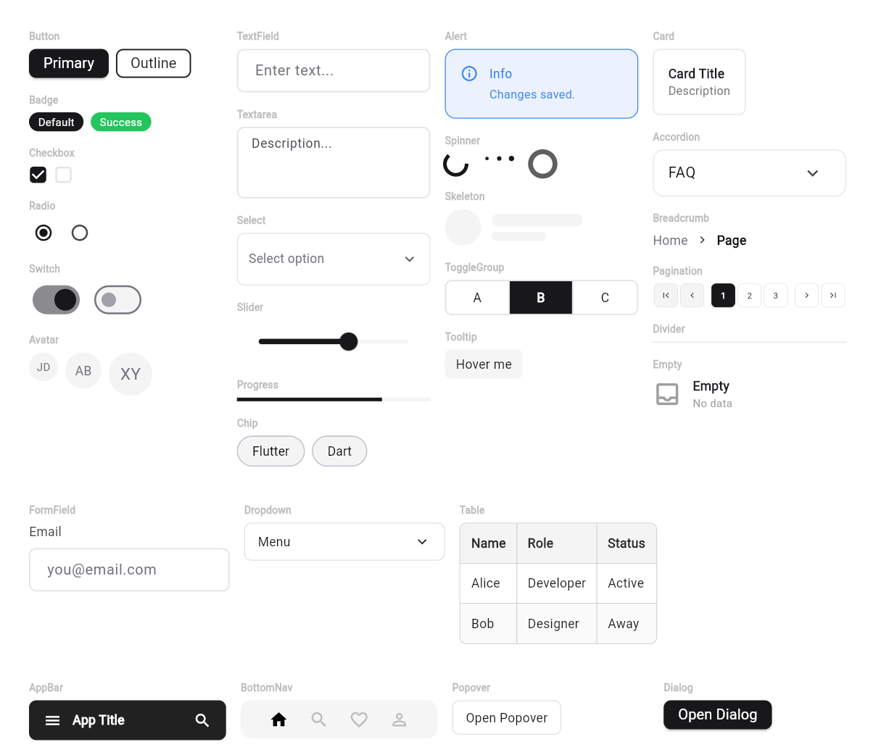
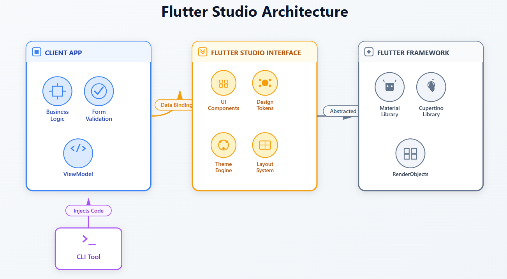
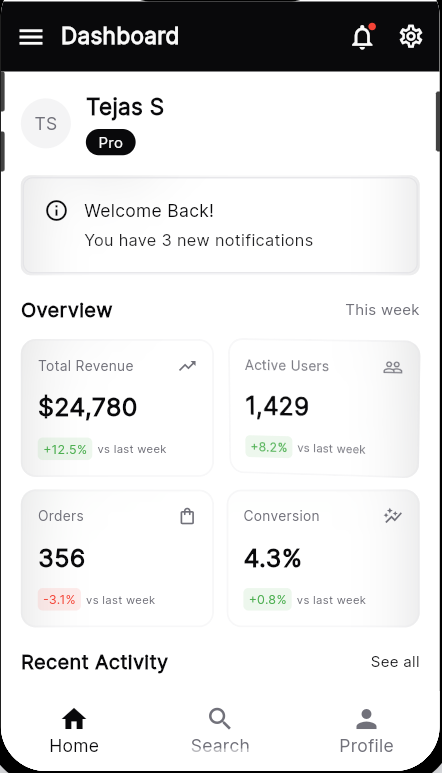
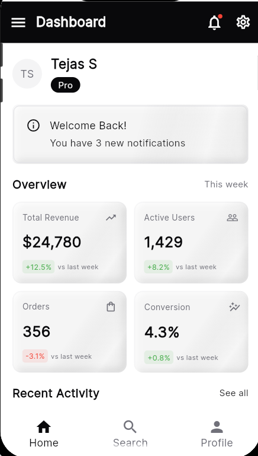
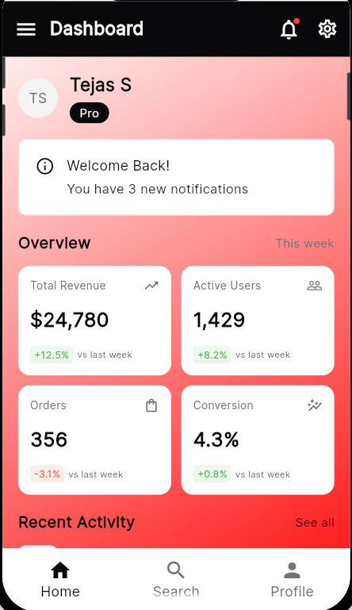
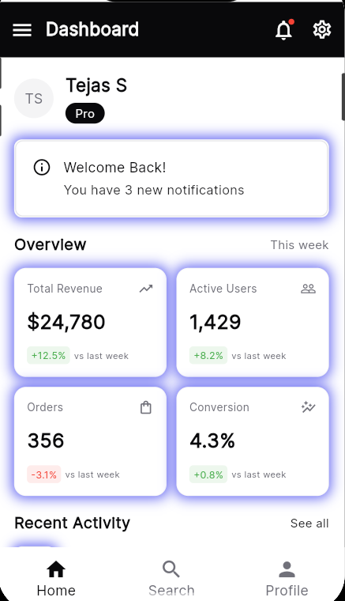

<div align="center">
  
# Bricolage UI

### Production-ready Flutter components that **you own**

**Stop fighting with boilerplate. Build your Design System in minutes, not months.**

[](https://pub.dev/packages/bricolage_ui_cli)
[](LICENSE)
[](https://bricolage-ui.vercel.app)
[](https://github.com/TejasS1233/bricolage-ui)

[Live Demo](https://bricolage-ui.vercel.app) • [Documentation](https://docs-bricolage-ui.vercel.app) • [CLI Tool](https://pub.dev/packages/bricolage_ui_cli)

**The shadcn/ui philosophy, adapted for Flutter.**



</div>


---

## See It In Action

**Build a polished login page in under 2 minutes** — from `flutter create` to production-ready UI.

https://github.com/user-attachments/assets/5e41003e-165f-4b9f-b4c6-c719c2de2f7a

*Install CLI → Add components → Build your page → Done!*


## Table of Contents

- [Stop Writing Boilerplate](#stop-writing-boilerplate)
- [Quick Start](#quick-start-60-seconds)
- [Why CLI-First?](#why-cli-first)
- [Architecture](#architecture-the-missing-layer)
- [Real-World Example](#real-world-example)
- [By The Numbers](#by-the-numbers)
- [10-Second Theming](#10-second-theming)
- [Available Components](#available-components-40)
- [Package Mode](#alternative-package-mode-rapid-prototyping)
- [Repository Structure](#repository-structure)
- [Contributing](#contributing)
- [Links](#links)

---

## Stop Writing Boilerplate

Compare raw Flutter to Bricolage UI. Same result, 90% less code.

| Raw Flutter (40+ lines)                                                                                                                                                                                                                                                                                                                                                                                                                                                                                                                                                                                                                                                                                                          | Bricolage UI (4 lines)                                                                                       |
| :------------------------------------------------------------------------------------------------------------------------------------------------------------------------------------------------------------------------------------------------------------------------------------------------------------------------------------------------------------------------------------------------------------------------------------------------------------------------------------------------------------------------------------------------------------------------------------------------------------------------------------------------------------------------------------------------------------------------------- | :----------------------------------------------------------------------------------------------------------- |
| `Container(`<br>&nbsp;&nbsp;`decoration: BoxDecoration(`<br>&nbsp;&nbsp;&nbsp;&nbsp;`borderRadius: BorderRadius.circular(8),`<br>&nbsp;&nbsp;&nbsp;&nbsp;`border: Border.all(color: Colors.grey),`<br>&nbsp;&nbsp;`),`<br>&nbsp;&nbsp;`child: TextField(`<br>&nbsp;&nbsp;&nbsp;&nbsp;`decoration: InputDecoration(`<br>&nbsp;&nbsp;&nbsp;&nbsp;&nbsp;&nbsp;`labelText: 'Email',`<br>&nbsp;&nbsp;&nbsp;&nbsp;&nbsp;&nbsp;`hintText: 'user@example.com',`<br>&nbsp;&nbsp;&nbsp;&nbsp;&nbsp;&nbsp;`border: InputBorder.none,`<br>&nbsp;&nbsp;&nbsp;&nbsp;&nbsp;&nbsp;`contentPadding: EdgeInsets.all(16),`<br>&nbsp;&nbsp;&nbsp;&nbsp;&nbsp;&nbsp;`// ... 30 more lines`<br>&nbsp;&nbsp;&nbsp;&nbsp;`),`<br>&nbsp;&nbsp;`),`<br>`)` | `CustomTextField(`<br>&nbsp;&nbsp;`label: 'Email',`<br>&nbsp;&nbsp;`placeholder: 'user@example.com',`<br>`)` |

---

## Quick Start (60 seconds)

```bash
# 1. Install CLI
dart pub global activate bricolage_ui_cli

# 2. Initialize in your project
cd your_flutter_app
bricolage_ui init

# 3. Add components
bricolage_ui add button textfield card

# 4. Start building
# Components are now in lib/components/ - they're yours to customize!
```

**That's it!** The components are now in your project. No external dependencies, full customization.

You can even uninstall the CLI after generating components - the code is **yours to keep**.

---

## Why CLI-First?

Unlike traditional packages, Bricolage UI copies source code directly into your project. This gives you complete control and zero runtime overhead.

| Feature             | CLI (Production)           | Package (Prototype)      |
| ------------------- | -------------------------- | ------------------------ |
| **Code Ownership**  | Code lives in your project | External dependency      |
| **Customization**   | Modify anything freely     | Limited to exposed props |
| **Runtime Deps**    | Zero dependencies          | Package adds to bundle   |
| **Version Control** | Track component changes    | Package version only     |
| **Bundle Size**     | Only what you use          | Entire package           |
| **Future-Proof**    | Delete CLI anytime         | Tied to package updates  |

**Think of it like shadcn/ui:** Components become part of your codebase, not an external dependency you're locked into.

---

## Architecture: The Missing Layer

Bricolage UI acts as a semantic bridge between your business logic and Flutter's rendering layer, letting you focus on features instead of styling boilerplate.

<div align="center">
  
</div>

**How it works:**

- **Your Client App** handles business logic, validation, and state management
- **Bricolage UI Interface** provides the design system (components, tokens, themes, layouts)
- **Flutter Framework** renders everything using Material/Cupertino widgets
- **CLI Tool** injects component code directly into your project

**Result:** Your ViewModels stay clean. Your Views stay simple. Your app ships faster.

---

## Real-World Example

```dart
// Your LoginScreen stays focused on logic
class LoginView extends StatelessWidget {
  @override
  Widget build(BuildContext context) {
    final vm = context.watch<LoginViewModel>();

    return Scaffold(
      appBar: CustomAppBar(title: 'Login'),
      body: Padding(
        padding: EdgeInsets.all(16),
        child: Column(
          children: [
            CustomTextField(
              label: 'Email',
              errorText: vm.emailError,
              onChanged: vm.setEmail,
            ),
            SizedBox(height: 16),
            CustomTextField(
              label: 'Password',
              isPassword: true,
              errorText: vm.passwordError,
              onChanged: vm.setPassword,
            ),
            SizedBox(height: 24),
            CustomButton(
              text: 'Sign In',
              isLoading: vm.isSubmitting,
              onPressed: vm.submit,
            ),
          ],
        ),
      ),
    );
  }
}
```

**No boilerplate. No styling chaos. Just clean, readable code.**

---

## By The Numbers

- **40+ Components** - Everything from buttons to data tables
- **Zero Dependencies** - CLI mode adds no runtime overhead
- **100% Customizable** - Code lives in your project
- **Accessibility First** - WCAG compliant out of the box
- **Theme System** - 40+ color tokens, typography scales
- **5 Preset Layouts** - Dashboard, Profile, Feed, Form, Settings

---

## 10-Second Theming

Don't settle for Material Blue. Bricolage UI comes with **12+ professional presets**, or build your own.

|                    **Default**                     |                    **Neo-Brutalism**                     |                  **Cyberpunk**                   |                 **Bento/iOS**                  |
| :------------------------------------------------: | :------------------------------------------------------: | :----------------------------------------------: | :--------------------------------------------: |
|  |  |  |  |
|               _Clean SaaS aesthetic_               |                  _Gumroad/Notion style_                  |              _Dev tools & CLI apps_              |           _Apple-inspired squircles_           |

**Also available:** Bubblegum, Vintage, Amethyst, Spring, Monochrome, Retro Windows

### How it works:

1. **Pick a preset** in the [web preview](https://bricolage-ui.vercel.app) dropdown
2. **Customize** colors, typography, spacing, and visual effects
3. **Export** → Theme is generated as a single unified `theme.dart` file
4. **Copy-paste** the generated file into your project's `lib/theme/` folder

```dart
// Your exported theme (lib/theme/theme.dart)
class UIColors {
  static const Color primary = Color(0xFFFFE600);    // Neo-Brutalism yellow
  static const Color background = Color(0xFFFFFBEB); // Warm white
  static const Color border = Color(0xFF000000);     // Sharp black borders
  // ... all your customized colors
}

class UITypography {
  static const double fontSizeBase = 16.0;
  // ... typography settings
}

class UIRadius {
  static const double md = 8.0;
  // ... radius values
}
// ... and more theme classes in one file
```

---

## Visual Effects

Apply professional visual effects to any component. All effects are customizable and work seamlessly with any theme.

|                   **Glassmorphism**                    |                   **Neumorphism**                    |                  **Gradient**                   |                 **Border Glow**                 |
| :----------------------------------------------------: | :--------------------------------------------------: | :---------------------------------------------: | :---------------------------------------------: |
|  |  |  |  |
|           _Frosted glass with backdrop blur_           |           _Soft shadows and highlights_            |         _Smooth color transitions_          |        _Glowing animated borders_         |

**Also available:** Pulse, Floating, Tilt Hover, Hard Shadows, and Hover Animations

### How to use:

1. **Enable effects** in the Effects tab of the [web preview](https://bricolage-ui.vercel.app)
2. **Adjust parameters** like blur intensity, glow color, gradient angles
3. **Mix and match** - combine multiple effects for unique designs
4. **Export** → All effect settings are included in your `theme.dart` file

Effects automatically work with buttons, cards, textfields, alerts, chips, and dashboard components.

---

## Recommended: CLI Tool (Production Mode)

The Bricolage UI CLI is the recommended approach for production applications. It copies component source code directly into your project.

**Installation:**

```bash
dart pub global activate bricolage_ui_cli
```

**Usage:**

```bash
bricolage_ui init                    # Setup your project
bricolage_ui add button card dialog  # Copy specific components
bricolage_ui add-all                 # Or get all 40+ components
bricolage_ui list                    # View all 40+ components
```

### Available Components (40+)

<table>
<tr>
<td width="33%">

**Inputs**

- TextField
- TextArea
- Checkbox
- Radio
- Switch
- Select
- Slider
- Dropdown

</td>
<td width="33%">

**Feedback**

- Alert
- Toast
- Dialog
- Spinner
- Progress
- Skeleton
- Badge

</td>
<td width="33%">

**Navigation**

- AppBar
- BottomNavBar
- Tabs
- Breadcrumb
- Pagination
- Divider

</td>
</tr>
<tr>
<td width="33%">

**Layout**

- Card
- Accordion
- BottomSheet
- Table

</td>
<td width="33%">

**Display**

- Avatar
- Chip
- Tooltip
- Empty
- Popover

</td>
<td width="33%">

**Forms**

- FormField
- ToggleGroup
- Select

</td>
</tr>
</table>

**[→ View full component gallery](https://docs-bricolage-ui.vercel.app)**

---

## Alternative: Package Mode (Rapid Prototyping)

Use the traditional package for quick mockups and demos where customization isn't critical.

**Installation:**

```bash
flutter pub add bricolage_ui
```

**Usage:**

```dart
import 'package:bricolage_ui/bricolage_ui.dart';

// Use components directly
CustomButton(
  text: 'Click Me',
  onPressed: () {},
)
```

**When to use Package Mode:**

- Building quick prototypes or demos
- Testing UI concepts rapidly
- Don't need extensive customization
- Prefer convenience over control

---

## Repository Structure

| Project         | Description                                     | Links                                                                              |
| --------------- | ----------------------------------------------- | ---------------------------------------------------------------------------------- |
| **CLI Tool**    | Production-ready component generator            | [README](bricolage_ui_cli/) • [pub.dev](https://pub.dev/packages/bricolage_ui_cli) |
| **Package**     | Rapid prototyping library                       | [pub.dev](https://pub.dev/packages/bricolage_ui)                                   |
| **Web Preview** | Interactive component customizer & theme editor | [Demo](https://bricolage-ui.vercel.app) • [README](bricolage_ui_preview/)          |
| **Docs**        | Full documentation site                         | [Docs](https://docs-bricolage-ui.vercel.app) • [README](bricolage_ui_docs/)        |

### `bricolage_ui_cli/`

CLI tool for production development. Copy components into your project with full customization control.

### `bricolage_ui/`

Component library package for rapid prototyping and demos.

### `bricolage_ui_preview/`

Interactive web application for customizing and previewing components in real-time.

**Features:**

- Customize theme (colors, typography, spacing, radius, shadows, fonts)
- Preview components on mobile/desktop frames
- 5 preset UI layouts (Dashboard, Profile, Feed, Form, Settings)
- Popular app theme presets (Netflix, Spotify, Amazon, etc.)
- Export customized theme files as ZIP

**Live Demo:** [https://bricolage-ui.vercel.app](https://bricolage-ui.vercel.app)


### `bricolage_ui_docs/`

Complete documentation website built with VitePress, featuring detailed component documentation, installation guides, and theming instructions.

**Features:**

- Comprehensive component documentation with API references
- Getting started guides and installation instructions
- CLI vs Package mode comparison
- Theming and customization guides
- Search functionality and responsive design

---

## Contributing

We welcome contributions! Whether you want to:

- Add new components
- Improve existing components
- Fix bugs or improve documentation
- Add new theme presets

Check out our [Contributing Guide](CONTRIBUTING.md) to get started.

**Ways to contribute:**

- Report issues on [GitHub](https://github.com/TejasS1233/bricolage-ui/issues)
- Submit pull requests for new components
- Improve documentation
- Share feedback and feature requests

---

## Links

- **Documentation:** [https://docs-bricolage-ui.vercel.app](https://docs-bricolage-ui.vercel.app)
- **CLI Tool:** [pub.dev/packages/bricolage_ui_cli](https://pub.dev/packages/bricolage_ui_cli)
- **Package:** [pub.dev/packages/bricolage_ui](https://pub.dev/packages/bricolage_ui)
- **Live Demo:** [bricolage-ui.vercel.app](https://bricolage-ui.vercel.app)
- **GitHub:** [github.com/TejasS1233/bricolage-ui](https://github.com/TejasS1233/bricolage-ui)

---

<div align="center">

**Ready to build faster?**

[Get Started](https://docs-bricolage-ui.vercel.app/docs/installation) • [View Demo](https://bricolage-ui.vercel.app) • [Star on GitHub](https://github.com/TejasS1233/bricolage-ui)

For Flutter developers who value their time

</div>
